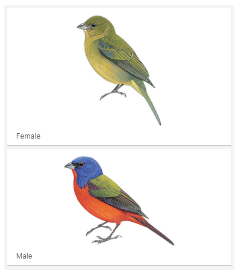

```{r setup, include=FALSE}
knitr::opts_chunk$set(echo = TRUE)
```


This tutorial goes through some of the colour analysis tools for **spectrophotometric** data.  
We will use measurements taken on museum specimens of the Painted Bunting (*Passerina ciris*) at the American Museum of Natural History.  





Plumage patches:
                1) Forehead   
                2) Head  
                3) Back  
                4) Throat  
                5) Chest  
                6) Belly  
                
I measured each plumage patch 5 times, repositioning the probe on the plumage each time.  
I callibrated agains a WS-1 white standard before measuring each specimen.


```{r, Specimens data, echo=FALSE}
Passerina_data <- read.csv("Passerina ciris/specimens Passerina spp.csv",
                           sep=";",
                           header=T)
Passerina_data


```

##First step: load spectra + polishing

The pavo package loads and reads as spectra files created by the spectrophotometer (e.g. .spec, .txt). Spectra can also be uploaded from .csv files but need to be formatted with the as.rspec() function. Before proceeding to estimate colour variables and apply visual models we need to polish the data a bit.

```{r}
library(pavo)
pcir <- getspec("Passerina ciris", ext = "txt", decimal = ".")

#check that the files have spectra attributes -> should say true
is.rspec(pcir)

#the spectra include reflectance between 300 - 700 nm and have one reflectance
#value per wavelength (interpolated from the original values).

pcir[100:110, 1:4]

plot(pcir)


```
```{r}


#Some spectra have negative values on the UV part of the spectrum. This is 
#physically impossible, but usually happens. When reflectace is very low, 
#reflectance values are noisy. This has to be fixed. There are two options: 
#1) add the max absolute negative value and push all the spectra higher (addmin)
#; and 2) replace negative values with zeros

pcir_nonegs <-procspec(pcir, fixneg= "zero")

plot(pcir_nonegs)

#Now we need to average the 5 repetitions taken for each plumage patch.
#the script will average contiguous columns, so we have to make sure we have 
#exactly 5 spectra per plumage patch and individual. 
#I measured 8 individuals on 6 patches, so I should end up with 48 spectra.

pcir_mean <- aggspec(pcir_nonegs, by = 5, FUN = mean)
pcir_mean[1:10, 1:5]
dim(pcir_mean)

#Finally, I want to create subsets groupping all the spectra for the same plumage patch


pcir_p1 <- subset(pcir_mean, "p1")
pcir_p2 <- subset(pcir_mean, "p2")
pcir_p3 <- subset(pcir_mean, "p3")
pcir_p4 <- subset(pcir_mean, "p4")
pcir_p5 <- subset(pcir_mean, "p5")
pcir_p6 <- subset(pcir_mean, "p6")


```

## Step two: Colour description

Now that the spectra are arranged by plumage patch we can estimate variables to describe colour (brightness, hue, chroma or saturation) and graph spectra


```{r}
#With the aggplot we can plot mean (+/- SE) spectra by groups of samples we 
#want to compare. I'll separate by sex in this case

#First I need to create a grouping variable that separates spectra by sex 

pcir_p1_sex <-gsub('[^hm]', "", names(pcir_p1))[-1]
table(pcir_p1_sex)
pcir_p2_sex <-gsub('[^hm]', "", names(pcir_p2))[-1]
table(pcir_p2_sex)
pcir_p3_sex <-gsub('[^hm]', "", names(pcir_p3))[-1]
table(pcir_p3_sex)
pcir_p4_sex <-gsub('[^hm]', "", names(pcir_p4))[-1]
table(pcir_p4_sex)
pcir_p5_sex <-gsub('[^hm]', "", names(pcir_p5))[-1]
table(pcir_p5_sex)
pcir_p6_sex <-gsub('[^hm]', "", names(pcir_p6))[-1]
table(pcir_p6_sex)

#Now I will plot mean spectra by sex with a shaded area indicating standard 
#error

aggplot(pcir_p1, pcir_p1_sex, FUN.error=function(x)sd(x)/sqrt(length(x)), 
        legend=TRUE, ylim=c(0,50), main="Forehead")
aggplot(pcir_p2, pcir_p2_sex, FUN.error=function(x)sd(x)/sqrt(length(x)), 
        legend=TRUE, ylim=c(0,50), main="Head")
aggplot(pcir_p3, pcir_p3_sex, FUN.error=function(x)sd(x)/sqrt(length(x)), 
        legend=TRUE, ylim=c(0,60), main="Back")
aggplot(pcir_p4, pcir_p4_sex, FUN.error=function(x)sd(x)/sqrt(length(x)), 
        legend=TRUE, ylim=c(0,50), main="Throat")
aggplot(pcir_p5, pcir_p5_sex, FUN.error=function(x)sd(x)/sqrt(length(x)), 
        legend=TRUE, ylim=c(0,50), main="Chest")
aggplot(pcir_p6, pcir_p6_sex, FUN.error=function(x)sd(x)/sqrt(length(x)), 
        legend=TRUE, ylim=c(0,50), main="Belly")


```
```{r}
#We can extract the values for a large set of spectral variables included in 
##pavo. Those values can be exported to a .csv file for further analyses. 
##The description of the 23 variables can be found running:

?summary.rspec


##A subset shows only the most commonly used variables.

summary(pcir_mean, subset=TRUE)

```

##Step three: incorporate visual perception

The colour variables are good to describe colour in a manner that is easy to interpret, but differences in these variables not necessarily imply differences that are biologically meaningful. For that, we can apply avian visual models that integrate reflectance data with visual sensitivity, although it requires making some assumptions. 

1) Tetracolour space (TCS)  
This model transforms colours into point on the tetrahedral colour space of birds. Colour variables can be estimated from the position of every colour in this tetrahedron relative to the maximum sensitivity of the visual system of the receptor. 

```{r warning=FALSE}
#The first step is to estimate photoreceptor quatum catches. These are a measure
#of the stimulation each photoreceptor receives, based on the reflectance spectra,
#and the physiological parameters of the visual system and the ambient light 
#conditions.

#for all plumage patches together
pcir_qc_rel <- vismodel (pcir_mean, visual="avg.uv", achromatic="bt.dc", 
                         relative=TRUE, vonkries=TRUE, bkg="ideal")


#The tetrachromatic colour space model (TCS) transforms the quantum catches
#into a point in the tetrahedral colour space diagram.

pcir_tcs <- colspace(pcir_qc_rel, space = c("tcs"))

#the colour points can be plotted. I subset them by sex and plot both sexes on 
#the same tetrahedron. 

tcs_males <-subset(pcir_tcs, "m")
tcs_females <-subset(pcir_tcs, "h")
tcsplot(tcs_males, col="blue", size = 0.01)
tcspoints(tcs_females, col = "red", size = 0.01)
tcsvol(tcs_females, col = "red")
tcsvol(tcs_males, col= "blue")


#can also calculate and graph the volumen overlapped between groups
voloverlap(tcs_males, tcs_females, plot = TRUE)


```
```{r}

#TCS estimates variables describing colours in the avian visual space. These are 
#harder to interpret, but framed within an avian visual perception model

View(pcir_tcs)

#Description of this variables in the function's description and 
#Stoddard and Prum 2008

?tcspace

pcir_sex <-gsub('[^hm]', "", rownames(pcir_tcs))
table(pcir_sex)

#with summary we can get summary statistics by groups. The most commonly used
#are Colspan (diversity of colours) and Huedisp (how different are the most 
#different colour within the sample)

summary(pcir_tcs, by = pcir_sex)


```
```{r eval=FALSE, message=FALSE, warning=FALSE, include=FALSE}
#colour distances can be calculated with the colourspace model, but this are 
#euclidean distances and should not be interpreted as perceptual distances

coldist(pcir_tcs, subset = c("m", "h"))
```

2) Receptor-noice limited model (RNL, Vorobyev and Osorio 1998)

This model allows to calculate colour differences in terms of JND (Just Noticeable Differences). 


```{r}
#To estimate colour perceptual distances with the RNL we have to use absolute
#quantum catches . I will compare colour between sexes for each 
#plumage patch separately. Quantum catches don't have to be relative for this 
#calculation (relative=FALSE).

pcir_qc_abs <- vismodel (pcir_mean, visual="avg.uv", achromatic="bt.dc", 
                         relative=FALSE, vonkries=TRUE, bkg="ideal")

pcir_qc_p1 <- subset(pcir_qc_abs, "p1")
pcir_qc_p2 <- subset(pcir_qc_abs, "p2")
pcir_qc_p3 <- subset(pcir_qc_abs, "p3")
pcir_qc_p4 <- subset(pcir_qc_abs, "p4")
pcir_qc_p5 <- subset(pcir_qc_abs, "p5")
pcir_qc_p6 <- subset(pcir_qc_abs, "p6")

#The coldist funcion will estimate dS considering some assumed parameters values
#A subset can be specified so the comparisons are made between groups, 
#in this case sexes.

pcir_p1_sd <- coldist (pcir_qc_p1, n=c(1,2,2,4), weber=0.1, achromatic = 0.1, 
                       subset=c("m", "h"))
pcir_p2_sd <- coldist (pcir_qc_p2, n=c(1,2,2,4), weber=0.1, achromatic = 0.1, 
                       subset=c("m", "h"))
pcir_p3_sd <- coldist (pcir_qc_p3, n=c(1,2,2,4), weber=0.1, achromatic = 0.1, 
                       subset=c("m", "h"))
pcir_p4_sd <- coldist (pcir_qc_p4, n=c(1,2,2,4), weber=0.1, achromatic = 0.1, 
                       subset=c("m", "h"))
pcir_p5_sd <- coldist (pcir_qc_p5, n=c(1,2,2,4), weber=0.1, achromatic = 0.1, 
                       subset=c("m", "h"))
pcir_p6_sd <- coldist (pcir_qc_p6, n=c(1,2,2,4), weber=0.1, achromatic = 0.1,
                       subset=c("m", "h"))
```


```{r message=FALSE, warning=FALSE}

#We could calculate the mean of these comparisons and see how they are relative to
#the theoretical perceptual threshold (1 JND). But intra-group differences
#can be very variable and mean dS between groups does not account for
#statistical relevance of the differences between groups 
#(see Maia and White, 2018 - Behavioural Ecology). Bootcoldist function allows 
#estimating 95% CI and mean dS

#forehead
pcir_qc_bysex_p1<-gsub("[^hm]", "", rownames(pcir_qc_p1))
bootcoldist(pcir_qc_p1, pcir_qc_bysex_p1, n=c(1,2,2,4), weber=0.1, 
            weber.achro=0.1)

#head
pcir_qc_bysex_p2<-gsub("[^hm]", "", rownames(pcir_qc_p2))
bootcoldist(pcir_qc_p2, pcir_qc_bysex_p2, n=c(1,2,2,4), weber=0.1, 
            weber.achro=0.1)

#back
pcir_qc_bysex_p3<-gsub("[^hm]", "", rownames(pcir_qc_p3))
bootcoldist(pcir_qc_p3, pcir_qc_bysex_p3, n=c(1,2,2,4), weber=0.1, 
            weber.achro=0.1)

#throat
pcir_qc_bysex_p4<-gsub("[^hm]", "", rownames(pcir_qc_p4))
bootcoldist(pcir_qc_p4, pcir_qc_bysex_p4, n=c(1,2,2,4), weber=0.1, 
            weber.achro=0.1)

#chest
pcir_qc_bysex_p5<-gsub("[^hm]", "", rownames(pcir_qc_p5))
bootcoldist(pcir_qc_p5, pcir_qc_bysex_p5, n=c(1,2,2,4), weber=0.1, 
            weber.achro=0.1)

#belly

pcir_qc_bysex_p6<-gsub("[^hm]", "", rownames(pcir_qc_p6))
bootcoldist(pcir_qc_p6, pcir_qc_bysex_p6, n=c(1,2,2,4), weber=0.1, 
            weber.achro=0.1)
```


For more tools and explanations you can see the package vignettes at https://rafaelmaia.net/pavo/articles/pavo.html

